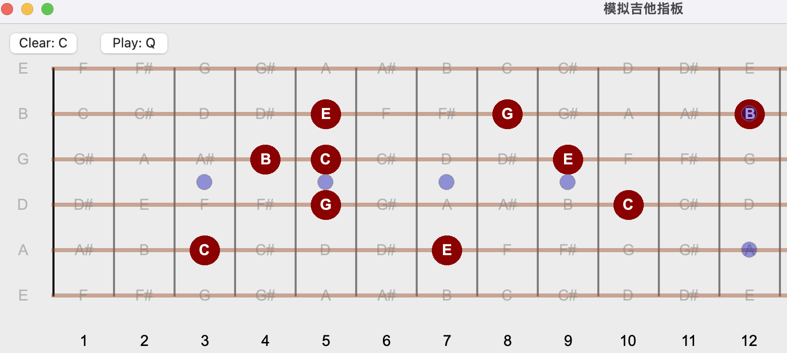

# GuitarFret
 Fretboard simulator that facilitate guitar arrangement.

Use: open dist/GuitarFret.app
or, python main.py

## Update Log
[2023-12-30]
- Fixed note name display issue at the 12-th fret.

[2023-12-06] 
- Add fret markers
- Add sound
- Add "Play" button
  